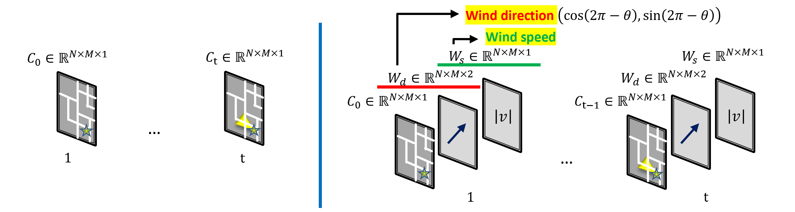
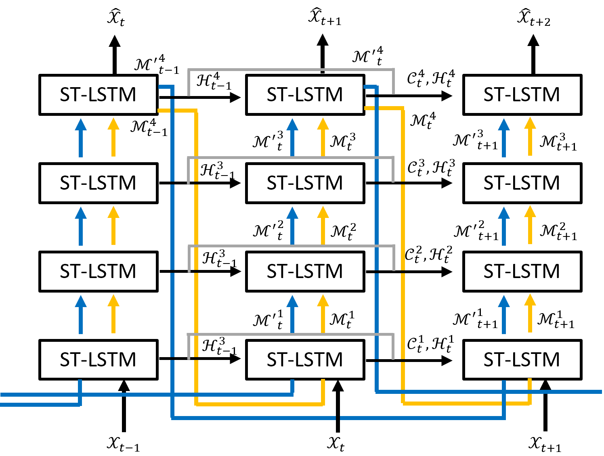
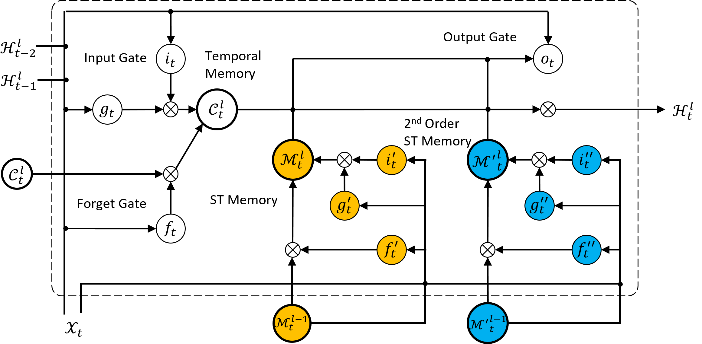

# Spatiotemporal Predictions of Toxic Urban Plumes using Deep Learning

This repository is built for the spatial-temporal prediction of cloud propagation in the air. The current work is mainly completed by Yinan Wang during his internship at Lawrence Livermore National Lab under the supervision of Drs. M. Giselle Fernández-Godino, Nipun Gunawardena, and Donald D. Lucas.


## Citation

If you find our work useful in your research, please consider to cite our manuscript.

```
@article{wang2024spatiotemporal,
  title={Spatiotemporal predictions of toxic urban plumes using deep learning},
  author={Wang, Yinan and Fern{\'a}ndez-Godino, M Giselle and Gunawardena, Nipun and Lucas, Donald D and Yue, Xiaowei},
  journal={arXiv preprint arXiv:2406.02582},
  year={2024}
}
```

## Installation

The code has been tested on following environment

```
Linux
python 3.10.10
CUDA 11.8
torch 2.0.0
scikit-learn 1.6.0
opencv-python 4.10.0
```

## Data Introduction

Each simulation contains a sequence of cloud propagation influenced by different wind speeds and directions. The input of the proposed method is the initial few steps and the output is the predicted future steps. The data is demonstrated as follows.



## Models

There are two models included in this repository. One the [PredRNN](https://github.com/thuml/predrnn-pytorch), the other is proposed [ST-GasNet++](./ST-GasNet/core/models/predrnn_memory_decoupling_2nd_order_ST.py). The architectures of these two models are demonstrated in the following figures. 

Model Structure of ST-GasNet++ |  Detailed Structure of Each Module
:-------------------------:|:-------------------------:
  |  


## Usage

There are several hyper-parameters need to be specified when training the model.

"--model_name": [predrnn_memory_decoupling](./ST-GasNet/core/models/predrnn_memory_decoupling.py), [predrnn_memory_decoupling_2nd_order_ST](./ST-GasNet/core/models/predrnn_memory_decoupling_2nd_order_ST), [predrnn_memory_decoupling_WSD](./ST-GasNet/core/models/predrnn_memory_decoupling_WSD.py), [predrnn_memory_decoupling_2nd_order_ST_WSD](./ST-GasNet/core/models/predrnn_memory_decoupling_2nd_order_ST_WSD)

The first two models are PredRNN and ST-GasNet++ without taking the wind info as the input, and the last two models are PredRNN and ST-GasNet++ with the wind info as the input.

"--train_data_paths" and "--valid_data_paths" specify the directory of data files.

"--img_channel" is 4 if wind info is taken as the input and is 1 otherwise.

"--save_dir" and "--gen_frm_dir" specify the directory save the trained model and results.

```
python run.py --batch_size xx --model_name xx --img_channel x

e.g. python run.py --batch_size 4 --model_name predrnn_memory_decoupling_2nd_order_ST --img_channel 1
     python run.py --batch_size 4 --model_name predrnn_memory_decoupling_2nd_order_ST_WSD --img_channel 4
```

## Results

The data used for training and testing can be found [here](./Data). There are two types of case studies. 

For *Case Study 1*, we randomly selected 36 sequences as the training data and used the remaining eight sequences as the testing data. As each sequence of observations is impacted by a unique combination of wind speed and direction, every single sequence in the testing data stores a dispersion process that is different in direction and/or speed from the training data. In the data [folder](./Data), the training and validation data used for *Case Study 1* DO NOT have "disjoint" in the file name.

For *Case Study 2*, we randomly split different wind directions as the training and testing data (i.e., all sequences generated with the wind direction as 250 degrees are assigned as the testing data), such that all sequences in the testing data are from the simulations with wind directions never observed in the training data. We still maintain 36 sequences in the training data and eight sequences in the testing data. In the data [folder](./Data), the training and validation data used for *Case Study 2* have "disjoint" in the file name.

The Pre-trained models are stored in [here](./Pretrained_Models). Eight types of models following different experiment settings are stored in individual folders. The folder follows the same naming scheme to indicate what types of backbone network (i.e., PredRNN or ST-GasNet), whether wind info is included (with or without "WSD"), and which case studies they are trained on (i.e., with or without "Disjoint"). Five pre-trained models are included for each experiment setting to reproduce the experiment results (mean and standard deviation).

Part of the results are demonstrated below.

Wind Speed (m/s) | Direction (degree) | Input |  Output (True) |  PredRNN (w/o wind) |  ST-GasNet++ (w/o wind) |  PredRNN (wind) |  ST-GasNet++ (wind)
:-------------------------:|:-------------------------:|:-------------------------:|:-------------------------:|:-------------------------:|:-------------------------:|:-------------------------:|:-------------------------:
340 | 3 |    |    |    |    |    |  
:-------------------------:|:-------------------------:|:-------------------------:|:-------------------------:|:-------------------------:|:-------------------------:|:-------------------------:|:-------------------------:
270 | 2 |    |    |    |    |    |  

## Acknowledgement

The implementation of PredRNN is based on [PredRNN](https://github.com/thuml/predrnn-pytorch).


